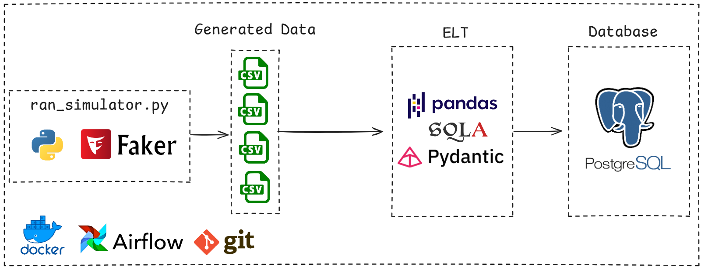

# RAN Traffic Monitor



This project is a **RAN (Radio Access Network) Traffic Monitoring System** designed to simulate, process, and store data related to telecommunications towers and their associated KPIs (Key Performance Indicators). The system leverages **Apache Airflow** for workflow orchestration, **PostgreSQL** for data storage, and **Python** for data simulation and processing.

## Features
- **Data Simulation**: Generates synthetic data for telecom towers and their KPIs using the `TowerDataGenerator` and `KPIDataGenerator` classes.

- **Data Ingestion**: Extracts and loads data into a PostgreSQL database using Airflow DAGs.

- **Database Management**: Provides CRUD operations for managing data in the database.

- **Workflow Orchestration**: Uses Apache Airflow to automate data generation, ingestion, and cleanup tasks.

## Project Structure
```
├── dags/                     # Airflow DAGs for workflow orchestration
│   ├── el_dag.py             # Extract and Load DAG
│   ├── simulator_dag.py      # Data simulation DAG
├── simulator/                # Data simulation logic
│   └── ran_simulator.py      # Tower and KPI data generators
├── src/                      # Core application logic
│   ├── crud.py               # CRUD operations for the database
│   ├── database.py           # Database connection and initialization
│   ├── models.py             # SQLAlchemy models for database tables
│   ├── schemas.py            # Pydantic schemas for data validation
├── .gitignore                # Git ignore file
├── docker-compose.yml        # Docker Compose configuration
├── Dockerfile                # Dockerfile for building the Airflow image
├── requirements.txt          # Python dependencies
└── README.md                 # Project documentation
```
## Prerequisites

- **Docker** and **Docker Compose** installed on your system.
- Python 3.8+ (if running locally without Docker).
- PostgreSQL database.

## Setup Instructions

### 1. Clone the Repository

```bash
git clone https://github.com/your-repo/ran-traffic-monitor.git
cd ran-traffic-monitor
```
### 2. Configure Environment Variables
Create a `.env` file in the root directory and define the following variables:

```bash
POSTGRES_APP_USER=your_app_user
POSTGRES_APP_PASSWORD=your_app_password
POSTGRES_APP_DB=your_app_db
POSTGRES_APP_HOST=db-application
POSTGRES_APP_PORT=5432

POSTGRES_AIRFLOW_USER=your_airflow_user
POSTGRES_AIRFLOW_PASSWORD=your_airflow_password
POSTGRES_AIRFLOW_DB=your_airflow_db
```
### 3. Build and Start the Docker Containers
```bash
docker-compose up --build
```
This will start the following services:

- PostgreSQL database for the application (`db-application`).
- PostgreSQL database for Airflow (`db-airflow`).
- Airflow webserver and scheduler.
### 4.  Access the Airflow Web Interface
- Open your browser and navigate to `http://localhost:8080`.
- Log in with the default:
    - Username: `admin`
    - Password: `admin`
### 5. Run the Workflows
- Trigger the `simulation_dag` to generate synthetic data.
- Trigger the `el_dag` to ingest the generated data into the database.

## Key Components
### 1. Data Simulation
The `simulator/ran_simulator.py` module contains two main classes:

- `TowerDataGenerator`: Generates synthetic data for telecom towers, including geographic coordinates and city/state information.
- `KPIDataGenerator`: Generates synthetic KPI data for the towers, such as signal strength, latency, throughput, and more.
### 2. Airflow DAGs

- **`simulation_dag.py`**: Generates synthetic data for towers and KPIs and saves it as CSV files.
- **`el_dag.py`**: Extracts the generated data and loads it into the PostgreSQL database.
### 3. Database

The database schema is defined in `src/models.py` using SQLAlchemy. It includes:

- `TowerModel`: Represents telecom towers.
- `KPIModel`: Represents KPIs associated with the towers.
### 4. CRUD Operations

The `src/crud.py` module provides functions for creating, reading, updating, and deleting data in the database.

## Dependencies

The project uses the following Python libraries:

- `apache-airflow`: Workflow orchestration.
- `psycopg2-binary`: PostgreSQL database adapter.
- `Faker`: Synthetic data generation.
- `pandas`: Data manipulation and analysis.
- `pydantic`: Data validation.
- `python-dotenv`: Environment variable management.
- `SQLAlchemy`: ORM for database interaction.
## Future Improvements

- Add unit tests for data simulation and CRUD operations.
- Implement data visualization for KPIs.
- Enhance error handling and logging.

## License

This project is licensed under the MIT License. See the `LICENSE` file for details.

## Contact

For questions or feedback, please contact [mdouglstos@gmail.com]
